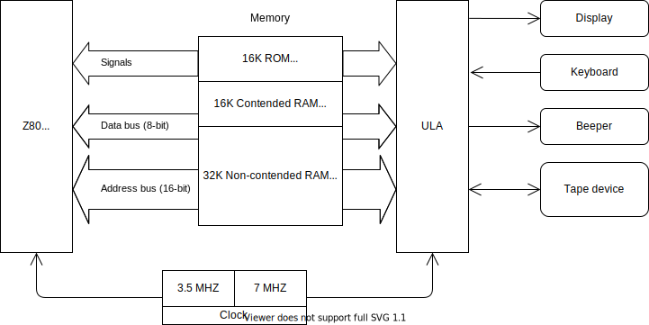

# ZX Spectrum Hardware Overview

The following figure is a high-level overview of the ZX Spectrum 48K and contains just enough details to understand how the computer works.

The ZX Spectrum 48K model has a relatively simple hardware architecture  (at least compared to modern computers). The Z80 CPU (the heart) and the ULA (the soul) are the two primary components of the system.

The Z80 (Zilog Z80) CPU is an 8-bit RISC microprocessor with 16-bit address space. Its operation set is over 1000 instructions.

The ULA (Uncommitted Logic Array) is a special chip that encapsulates the hardware logic that handles peripheral devices like the display, the keyboard, tape, and the one-bit beeper.

## The Heart and the Soul

The computer uses a 7MHz clock signal to drive the ULA and half of this frequency, 3.5MHz, to control the Z80 CPU. As you learn soon, accurate timing is a crucial feature of emulators; without it, you can hardly implement a high-fidelity emulation of the actual hardware. This capability is especially true for the ZX Spectrum, as many games use fine-tuned timing to implement special graphics features.

The CPU and the ULA both use the 16-bit address bus and the 8-bit data bus to access system resources, such as the memory and I/O ports. The Z80 CPU uses all 16 lines to address the memory, and the ULA utilizes only the lower 14 address lines to read the memory and only the least significant line (A0) to address the I/O ports. Every even port number (when A0 is 0) activates the ULA to read or write the single I/O port it handles. When you address an odd port number, the ULA remains passive.

The CPU and the ULA both use the 16-bit address bus and the 8-bit data bus to access system resources, such as the memory and I/O ports. The Z80 CPU uses all 16 lines to address the memory, and the ULA utilizes only the lower 14 address lines to read the memory and only the least significant line (A0) to address the I/O ports. Every even port number (when A0 is 0) activates the ULA to read or write the single I/O port it handles. So, you have a single logical port (that can be accessed through every even port number) in ZX Spectrum 48 to handle all input and output devices. When you address an odd port number, the ULA remains passive.

The CPU and the ULA also must co-operate when using the memory. At a particular moment, only one of them can put an address to the address bus to read or write a particular byte; the other component must wait until the first one releases the bus.

In ZX Spectrum, the ULA has priority over the CPU. Whenever the ULA wants to read the memory, it set a CPU signal called WAIT to a low state, preventing the CPU from carrying out memory operations.

The ZX Spectrum 48K has a total of 64KByte memory. 16K of it is ROM, occupying the physical memory's lowest range (from address `0000` to `3fff`). The other 48K of memory is RAM. The range from `4000` to `7fff` is the 16K slot that both the CPU and the ULA can access. This section is a contended part of the memory; the ULA has priority over the Z80 when reading the contents. Since only the CPU can address the last 32K RAM, from `8000` to `ffff`, it is non-contended RAM.

## The Z80 CPU

Z80 is a RISC microprocessor with a few 8-bit and 16-bit registers (most of the latest can be used as a pair of 8-bit registers). It has a collection of flags (the bits of Register F) set and reset by arithmetic and logic statements. The following figure displays the pinout with the signals on the left, the address, and the data bus to the right. 

*Source*: https://en.wikipedia.org/wiki/Zilog_Z80

Implementing the Z80 instruction set is not rocket science. However, there are a few quirks you should know. First, Z80 has more than 400 instructions not documented in the official specification. Second, two flags out of the eight contained in register F are not documented; however, the CPU instructions change them. The Z80 also contains an internal 16-bit register (the community mentions it as `MEMPTR`), which programmers cannot access directly. Unfortunately, the value of this register influences the undocumented bits of register F.

*Source*: https://en.wikipedia.org/wiki/Zilog_Z80

> *Note*: The figure shows `MEMPTR` as the pair of the internal `W` and `Z` registers.

Fortunately, you can find reliable documentation about the officially undocumented instructions and the behavior of the two special flags and `MEMPTR`.

> *Hint*: While developing the emulator, I used this document: http://www.z80.info/zip/z80-documented.pdf

Many games leverage undocumented instructions because they provide real value for programmers. Though there is no reason to use the two special flags (and even less to access `MEMPTR`), you still cannot ignore implementing them in an emulator. You can push the flags to the stacks and pop them. Assume you make conditional branching according to the popped value (that may contain the flags). Your control flow in an emulator may take a different route than in the actual hardware if you do not implement handling the extra flags. As a developer of an emulator, you definitely want to avoid such a situation.

## Screen Generation

Undoubtedly, the most complex process of ZX Spectrum is screen generation. The ULA generates a new screen frame in every (closely) 20 milliseconds, more precisely, with a periodicity of 69888 T-states (or clock cycles).

> *Note*: The CPU's clock frequency is 3.5MHz, which means the Spectrum generates `3'500'000 / 69'888 ~= 50.08` screen frames per second. The ULA works with a 7MHz clock signal, and it displays two pixels in each T-state.

Understanding the core of this process is crucial to designing the emulator, so here, you learn the fundamentals.

When ZX Spectrum was designed, displaying a screen meant to control a cathode ray tube, the electron beam inside the tube moved from top to bottom and left to right. The ULA encapsulates a control logic that ensures accurately following the movement of the electron beam. Without going into the exact details (this is not an electrical engineering project), this is how the electron beam moves while rendering the screen:
1. The beam moves to the top-left position of the cathode ray tube to the very first raster line (in the PAL system, the screen contains 625 lines). According to the current settings of the displaying equipment (a traditional TV set), the few first and last raster lines (such as the left and right edges) cannot be seen.
2. The beam draws 312 raster lines (odd lines), moving from the top to the bottom and left to right in about 20ms. (This is called a half-screen, as this phase draws only every second raster line. 
3. Then, the beam jumps to the leftmost position of the second raster line and now draws the second half-screen (every even raster line).
4. In steps 2 and 3, when completing an entire raster line, the electron beam jumps back to the beginning of the subsequent raster line.

> *Note*: Again, the actual screen-generation with a cathode ray tube is more complex, but we do not need to dive deeper into the topic to be prepared for creating an emulator.

The ULA takes care of the accurate timing and setting the intensity of the electron beam. The screen generation logic carries out a particular activity in each T-states of a frame as a combination of two operations:
Displays the next pixel (nothing, a pixel with the current border color, the subsequent pixel of the visible part of the 256x192 computer screen)
Reads from the screen memory (the byte that defines eight pixels and the attribute byte that determines the color of pixels)

> *Note*: The ULA defines ten different activities from the combinations of the two operations above.

## Interrupts

## The Keyboard

## The Beeper

## The Tape 

