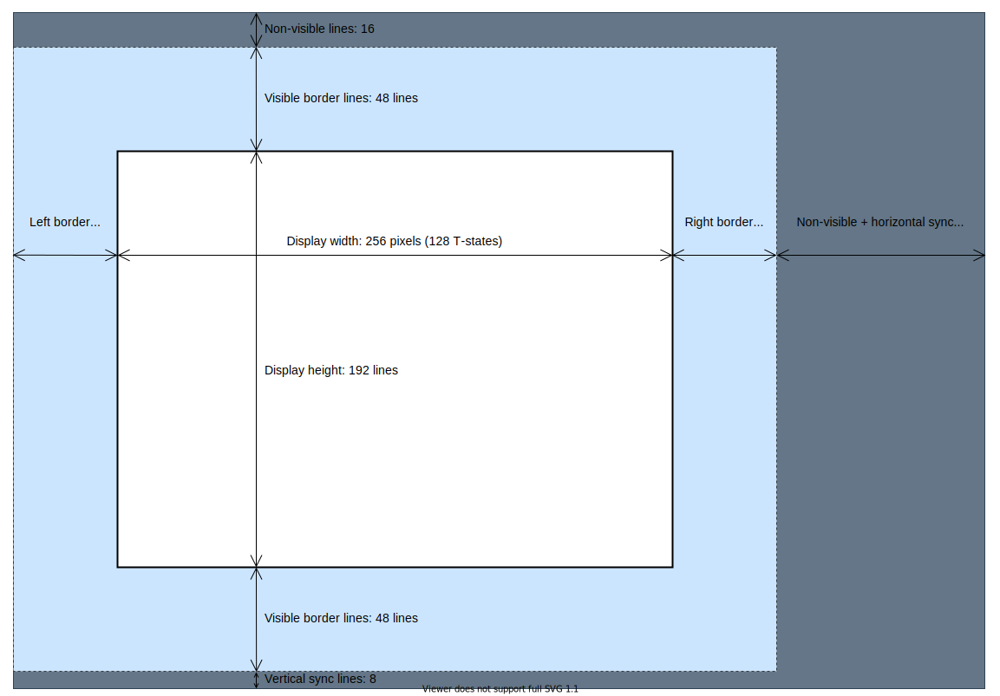
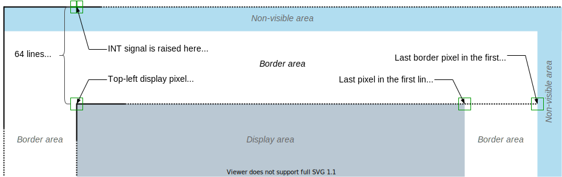
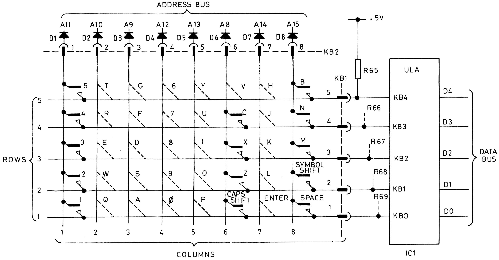

# The ZX Spectrum 48K Hardware with the Eye of an Emulator Developer

The following figure is a high-level overview of the ZX Spectrum 48K and contains just enough details to understand how the computer works.

The ZX Spectrum 48K model has a relatively simple hardware architecture (at least compared to modern computers). The Z80 CPU (the heart) and the ULA (the soul) are the two primary components of the system.

The Z80 (Zilog Z80) CPU is an 8-bit RISC microprocessor with 16-bit address space. Its operation set is over 1000 instructions.

The ULA (Uncommitted Logic Array) is a special chip that encapsulates the hardware logic that handles peripheral devices like the display, the keyboard, tape, and the one-bit beeper.

The computer uses a 7MHz clock signal to drive the ULA and half of this frequency, 3.5MHz, to control the Z80 CPU. As you learn soon, accurate timing is a crucial feature of emulators; without it, you can hardly implement a high-fidelity emulation of the actual hardware. This capability is especially true for the ZX Spectrum, as many games use fine-tuned timing to implement special graphics features.

## The Heart and the Soul

The CPU and the ULA both use the 16-bit address bus and the 8-bit data bus to access system resources, such as the memory and I/O ports. The Z80 CPU uses all 16 lines to address the memory, and the ULA utilizes only the lower 14 address lines to read the memory and only the least significant line (A0) to address the I/O ports. Every even port number (when A0 is 0) activates the ULA to read or write the single I/O port it handles. When you address an odd port number, the ULA remains passive.

The CPU and the ULA both use the 16-bit address bus and the 8-bit data bus to access system resources, such as the memory and I/O ports. The Z80 CPU uses all 16 lines to address the memory, and the ULA utilizes only the lower 14 address lines to read the memory and only the least significant line (A0) to address the I/O ports. Every even port number (when A0 is 0) activates the ULA to read or write the single I/O port it handles. So, you have a single logical port (that can be accessed through every even port number) in ZX Spectrum 48 to handle all input and output devices. When you address an odd port number, the ULA remains passive.

The CPU and the ULA also must co-operate when using the memory. At a particular moment, only one of them can put an address to the address bus to read or write a particular byte; the other component must wait until the first one releases the bus.

In ZX Spectrum, the ULA has priority over the CPU. Whenever the ULA wants to read the memory, it set a CPU signal called WAIT to a low state, preventing the CPU from carrying out memory operations.

The ZX Spectrum 48K has a total of 64KByte memory. 16K of it is ROM, occupying the physical memory's lowest range (from address `0000` to `3fff`). The other 48K of memory is RAM. The range from `4000` to `7fff` is the 16K slot that both the CPU and the ULA can access. This section is a contended part of the memory; the ULA has priority over the Z80 when reading the contents. Since only the CPU can address the last 32K RAM, from `8000` to `ffff`, it is non-contended RAM.

## The Z80 CPU

Z80 is a RISC microprocessor with a few 8-bit and 16-bit registers (most of the latest can be used as a pair of 8-bit registers). It has a collection of flags (the bits of Register F) set and reset by arithmetic and logic statements. The following figure displays the pinout with the signals on the left, the address, and the data bus to the right.

_Source_: https://en.wikipedia.org/wiki/Zilog_Z80

Implementing the Z80 instruction set is not rocket science. However, there are a few quirks you should know. First, Z80 has more than 400 instructions not documented in the official specification. Second, two flags out of the eight contained in register F are not documented; however, the CPU instructions change them. The Z80 also contains an internal 16-bit register (the community mentions it as `MEMPTR`), which programmers cannot access directly. Unfortunately, the value of this register influences the undocumented bits of register F.

_Source_: https://en.wikipedia.org/wiki/Zilog_Z80

> _Note_: The figure shows `MEMPTR` as the pair of the internal `W` and `Z` registers.

Fortunately, you can find reliable documentation about the officially undocumented instructions and the behavior of the two special flags and `MEMPTR`.

> _Hint_: While developing the emulator, I used this document: http://www.z80.info/zip/z80-documented.pdf

Many games leverage undocumented instructions because they provide real value for programmers. Though there is no reason to use the two special flags (and even less to access `MEMPTR`), you still cannot ignore implementing them in an emulator. You can push the flags to the stacks and pop them. Assume you make conditional branching according to the popped value (that may contain the flags). Your control flow in an emulator may take a different route than in the actual hardware if you do not implement handling the extra flags. As a developer of an emulator, you definitely want to avoid such a situation.

## Screen Generation

Undoubtedly, the most complex process of ZX Spectrum is screen generation. The ULA generates a new screen frame in every (closely) 20 milliseconds, more precisely, with a periodicity of 69888 T-states (or clock cycles).

> _Note_: The CPU's clock frequency is 3.5MHz, which means the Spectrum generates `3'500'000 / 69'888 ~= 50.08` screen frames per second. The ULA works with a 7MHz clock signal, and it displays two pixels in each T-state.

Understanding the core of this process is crucial to designing the emulator, so here, you learn the fundamentals.

When ZX Spectrum was designed, displaying a screen meant to control a cathode ray tube, the electron beam inside the tube moved from top to bottom and left to right. The ULA encapsulates a control logic that ensures accurately following the movement of the electron beam. Without going into the exact details (this is not an electrical engineering project), this is how the electron beam moves while rendering the screen:

1. The beam moves to the top-left position of the cathode ray tube to the very first raster line (in the PAL system, the screen contains 625 lines). According to the current settings of the displaying equipment (a traditional TV set), the few first and last raster lines (such as the left and right edges) cannot be seen.
2. The beam draws 312 raster lines (odd lines), moving from the top to the bottom and left to right in about 20ms. (This is called a half-screen, as this phase draws only every second raster line.)
3. Then, the beam jumps to the leftmost position of the second raster line and now draws the second half-screen (every even raster line).
4. In steps 2 and 3, when completing an entire raster line, the electron beam jumps back to the beginning of the subsequent raster line.

> _Note_: Again, the actual screen-generation with a cathode ray tube is more complex, but we do not need to dive deeper into the topic to be prepared for creating an emulator.

The following figure shows the structure of the screen:

The visible part of the screen contains the display area and the border area:

- The display area takes 256x192 pixels.
- The border area wraps the display with 48-pixel wide and high borders. _Note_: Any emulator can use a smaller border area.

The entire screen frame has a non-visible area, representing the time when the electron beam returns from the right edge to the left or from the bottom of the screen to the top.

So, we have **312** raster lines (non-visible top: 16 + top border: 48 + display: 192 + bottom border: 48 + vertical sync: 8). Displaying the entire screen line takes **224 T-states** (left border: 24 + display: 128 + right border: 24 + horizontal sync: 48). Altogether we have **312x224 = 69888 T-states**.

The ULA takes care of the accurate timing and setting the intensity of the electron beam. The screen generation logic carries out a particular activity in each T-states of a frame as a combination of two operations:

1. Displays the next pixel (nothing, a pixel with the current border color, the subsequent pixel of the visible part of the 256x192 computer screen)
2. Reads from the screen memory (the byte that defines eight pixels and the attribute byte that determines the color of pixels)

> _Note_: The ULA defines ten different activities from the combinations of the two operations above.

Many games leverage this screen generation method and implement exciting features such as:

- drawing on the screen border;
- changing pixel attributes and emulating a higher color resolution than the ZX Spectrum has;
- implementing flicker-free screen updates.

To allow such games to run in the ZX Spectrum emulator, you must mimic the same logic when rendering the screen.

While reading the screen memory to prepare for rendering pixels, the ULA delays the CPU. While The ULA reads the data, it issues a `WAIT` signal to the CPU, preventing that from executing any memory-related operation. When the ULA has completed its read, it revokes the `WAIT` signal, and the CPU can carry on.

Fortunately, this delay is deterministic. For each of the 69888 T-states of a single screen frame, we can exactly tell the number of T-states the ULA delays the CPU, and so an emulator can implement this feature with high fidelity.

There's one more critical thing regarding screen generation. The floating bus feature allows tricky ways to query the approximate position of the raster line rendered by the virtual electron beam. You can read more details about it [here](#the-floating-bus).

## Interrupts

The Z80 CPU can handle two types of interrupts. Peripheral devices generally leverage the non-maskable interrupt (NMI), and this type, as its name suggests, cannot be suppressed. So, when a device raises a non-maskable interrupt, the CPU saves the current value of Program Counter to the stack and invokes the NMI handler method at address `$0066`.

The ZX Spectrum 48 does not handle non-maskable interrupt (unless some extra peripheral device does it).

The other type of interrupt is the maskable interrupt (INT). Developers can disable it with the `DI` instruction and enable it with `EI`. Z80 supports three interrupt modes:
- Interrupt mode zero (activated by the `IM 0` instruction) reads an instruction opcode from the bus and executes that particular instruction.
- Interrupt mode one (`IM 1`) executes an `RST $38` instruction (calls the handler routine at address `$0038`) and returns to the next instruction to continue the control flow.
-Interrupt mode two (`IM 2`) is more complex. It reads the current value from the bus (so a peripheral device can put that value to the bus just before raising the interrupt signal) and combines it with the value of register I to create a 16-bit address. During this operation, the I register provides the upper 8 bits (MSB), the value from the bus gives the lower 8 bits (LSB). This address is a storage location of the interrupt handler routine. So, the CPU reads the 16-bit value stored at this calculated address and executes the pointed interrupt handler routine.

The ZX Spectrum 48 (its operating system and BASIC interpreter) uses only IM 1, so by default, the interrupt handler is the routine at address `$0038`. This handler increments the real-time clock and queries the keyboard.

If an app or a game wants to handle interrupt in a specific way, it must turn on Interrupt mode 2 (`IM 2`). 

> *Note*. You can turn the CPU into Interrupt mode 0 with `IM 0`. Because ZX Spectrum does not have a particular device to put an operation code on the bus, the CPU would read an `$ff` byte. This value is the opcode for the `RST $38` instruction, so eventually, the CPU would execute the same handler (the routine starting at address `$0038`) as it would with Interrupt mode 1.

You already learned that accurate timing is a crucial element of a computer, and so a high fidelity emulator must implement such precise timing. Regarding this topic, there are a few essential facts you should know about ZX Spectrum 48K:

First, the Z80 CPU does not interrupt an instruction being executed. In the last phase of the current instruction, the CPU checks the `INT` signal. At that moment, the Program Counter register (PC) already points to the subsequent instruction. If the `INT` signal is active and the non-maskable interrupt is enabled, the CPU saves the value of PC to the stack, executes the interrupt handler method (according to the current mode, 0, 1, or 2). When the handler's execution completes, the control flow returns to the address saved to the stack at the beginning of the interrupt. As you just learned, it is the address of the subsequent information.

Second, The ULA in ZX Spectrum 48K generates a 32 T-states long interrupt signal. Because of the way the interrupt handler works, the hardware needs to use an appropriate interrupt signal length. If the signal is too short, the CPU may not observe it (remember, Z80 tests the interrupt signal only at the last T-state of instruction execution). Should the signal be too long, the CPU would return from the interrupt handler, execute a single instruction, and then invoke the interrupt handler again while the `INT` signal is active.

Because the longest Z80 instruction takes 23 T-states, a 32-T-state long signal is excellent enough to avoid missing an active `INT` and short enough to prevent multiple interrupt handler execution.

> *Note*: A minimal execution handler generally contains at least an `EI` (enable interrupt) and a `RET` (return) instruction. Their length, plus the length of the handler invocation mechanism, is longer than 32 T-states.

Third, the ULA activates the `INT` signal always at the same time within a screen rendering frame. The ULA has an internal clock to handle the 69888 T-states of screen rendering (from the ULA's point of view, it is actually 2x69888 = 139 776 clock cycles). The ULA activates the INT signal when the screen rendering process is exactly 64 raster lines before displaying the top-left pixel of the display. The following figure helps you understand how it goes:

Third, the ULA activates the `INT` signal always at the same time within a screen rendering frame. The ULA has an internal clock to handle the 69888 T-states of screen rendering (from the ULA's point of view, it is actually 2x69888 = 139 776 clock cycles). The ULA activates the INT signal when the screen rendering process is exactly 64 raster lines before displaying the top-left pixel of the display. The following figure helps you understand how it goes:

Rendering one line takes exactly 224 T-states (or 448 ULA clock cycles). The ULA activates the interrupt signal at T-state 0. 64 lines later, when it is at T-state 14336 (64x224), it renders the top-left display pixel. At T-state 14463 (14336 + 127), the rendering reaches the last display pixel in the first line. (Recall, the ULA displays two pixels during a single CPU clock cycle).

Following this pattern, you can calculate the T-state index of a particular screen pixel.

> *Note*: Games leverage this knowledge when they provide special effects, like drawing on the border. When the ULA activates the interrupt signal, there might be a delay because the CPU completes the current instruction before starting the interrupt handler. So, the interrupt handler cannot precisely know at which T-state index of the rendering process it starts.

## The Keyboard

ZX Spectrum 48K has 40 physical keys arranged in an 8x5 matrix:

*Source*: https://www.1000bit.it/support/manuali/sinclair/zxspectrum/sm/supp2.html

Querying the state of a particular key is pretty simple. You can use the Z80 CPU's `IN` instruction to query a particular ULA port (remember, ULA support only event port numbers). When you read an input port, the CPU puts the port address to the address bus. The keyboard uses the top 8 address lines (A8-A15). Each key is a push button. If you press any of them, they connect the corresponding address line value to one of the data bus lines (from 0 to 4).

You read a value bit 1 on its associated data line when a key is not pressed. To sense a pressed key, you issue an `IN` statement that puts a zero bit on the address line of the button, and the code checks the appropriate bit of the data read back.

For example, if you want to check if key R is pressed, read the value of port `$fbfe`. The `$fb` part sets the A10 line to zero, while the other lines between A8 and A15 to one. The `$fe` part takes care that the port address is even to active the ULA handle it as functioning I/O port.
If bit 3 of the value read back is 0, key R is pressed.

## The Beeper

ZX spectrum has a built-in speaker bound to a single output port bit and alternating that bit value with a particular frequency will generate a sound through the speaker. You can set the beeper bit value through bit 4 of the data sent to any port with sm even address.

## The Tape

*TBD*

## The Floating Bus

*TBD*