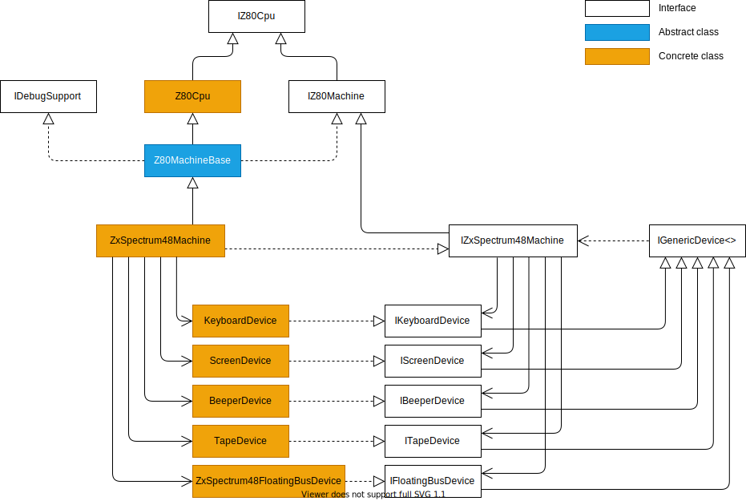

# The ZX Spectrum 48K Implementation Architecture

While working on the ZX Spectrum 48 implementation, I continuously reviewed and refined the implementation architecture. Currently, this class diagram shows the main components of the implementations:

## The Main Components

- `IZ80Cpu`: This interface defines the attributes and the behavior of the Zilog Z80 CPU.
- `Z80Cpu`: This class implements the Zilog Z80 CPU. See the [Z80 CPU Implementation](../z80/z80-implementation.md) article.
- `IZ80Machine`: This interface defines an emulated machine's common attributes and behavior using a Z80 CPU.
- `IDebugSupport`: This interface defines the methods and properties of emulated machines that support debugging the machine's operation.
- `Z80MachineBase`: This class implements a base class from which all Z80 CPU-based emulated machines can derive.
- `IZxSpectrum48Machine`: This interface represents the emulated hardware (and related software) components of ZX Spectrum 48.
- `ZxSpectrum48Machine`: This class implements the ZX Spectrum 48K emulator.
- `IGenericDevice`: This generic interface describes a piece of emulated hardware functionality (device) that belongs to a particular emulated machine.
- `IKeyboardDevice`: Represents a keyboard device where the state of individual keys can be set and queried.
- `KeyboardDevice`: This class is the default implementation of `IKeyboardDevice`. See the [Implementing the ZX Spectrum Keyboard](./keyboard-device.md) article.
- `IScreenDevice`: Represents the screen-rendering device, creating all screen pixes with the exact timing as the physical hardware.
- `ScreenDevice`: This class is the default implementation of `IScreenDevice`.
- `BeeperDevice`: Represents the one-bit beeper of ZX Spectrum 48, creating the samples that produce the emulated sound on the host machine.
- `BeeperDevice`: This class is the default implementation of `IBeeperDevice`.
- `ITapeDevice`: This interface represents the emulated tape to read and write data.
- `TapeDevice`: This class is the default implementation of `ITapeDevice`.
- `IFloatingBusDevice`: This class represents the floating bus behavior of the ZX Spectrum data bus.
- `ZxSpectrum48FloatingBusDevice`: This class implements the behavior of the ZX Spectrum 48 floating bus.

## Design Decisions

When designing the architecture, I divided the emulated hardware into components that provide a particular functionality of the physical hardware. There are many ways to split the hardware, and I have chosen this configuration to establish the software components:
- The Z80 CPU
- The memory access (The address bus and the data bus)
- The I/O port management (The address bus and the data bus)
- The keyboard management functionality (ULA)
- The screen rendering ability of the ULA
- The one-bit beeper handling  (ULA)
- The tape interface (ULA)
- The floating bus behavior (The ZX Spectrum 48 data bus)

Though this project now focuses on ZX Spectrum 48, I wanted to create a design that allows the implementation of other ZX Spectrum models (ZX Spectrum 128/2A/2A+/3E+, and ZX Spectrum Next) in the future.

### Interface Abstractions

I'm a rabid fan of test-driven development and automatic testing, so I decided to represent the emulated components with interfaces. Each component defines its behavior with an interface and has one or more implementations. A concrete class based on a particular interface contributes to the emulator, while tests may use other implementer classes.

For example, I have created a class, `TestZ80Cpu`, which uses a simple emulated machine, `Z80TestMachine`, to test if the Z80 CPU's implementation works as specified in the official (and non-official) documentation. `Z80TestMachine` implements a flat 64K RAM and provides I/O operation logging that is easy to use in unit tests.

### Z80-Base Machine Implementations Derive from `Z80Cpu`

From the implementation point of view, a natural (OOP) design concept is to create a class implementing the machine and aggregating emulated components into this class. That concept was the first one I implemented. However, later I changed the design because of performance reasons:
The `Z80Cpu` class intensively uses the memory component; for example, it fetches every instruction.

My first design had three classes, like these, to provide the connection between the CPU and the memory:  `Z80Cpu`, `Memory`, `Machine`, where `Machine` aggregated the other two. 
In that scenario, the CPU used two indirections to reach the memory:
First, `Z80Cpu` reached its `Machine` parent.
Second, through the parent, it went to `Memory` and invoked the method to read or write the specified byte within the memory.

From profiling the app, I saw that I could save some execution time by short-cutting those indirections if I would use C# (.NET) function references within the `Z80Cpu` class for the memory operation. That was my second design. In this one, the `Machine` set the memory handler function references of the `Z80Cpu` instance during the `Machine` construction time.

Later, I decided to use a more straightforward design that made it unnecessary to implement separate memory and an I/O handler component so that I could aggregate them with `Memory`. In this concept, the `Machine` class derives from `Z80Cpu` and uses virtual functions to implement memory and I/O operations. Performance measurement shows that this technique gives the best performance.

## Future Extensions with New Machines

This architecture is open for extension with other ZX Spectrum models. When implementing a new model, these are the tasks to carry out:
- We derive a new interface from `IZxSpectrum48Machine` (or maybe from `IZ80Machine)`, for example, `IZxSpectrum128Machine`.
- We derive a new class from `ZxSpectrum48Machine` (or maybe from `Z80MachnineBase`, for example, `ZxSpectrum128Machine`. This class overrides the memory and I/O handler routines following the addressing scheme of the new machine.
- We implement new devices (using the interface abstraction). For example, we add an `IPsgDevice` interface and its implementor class, `PsgDevice`, to emulate the ZX Spectrum 128's AY-3-8912 PSG (Programmable Sound Generator) chip.
- We integrate the new device classes with the new machine.
